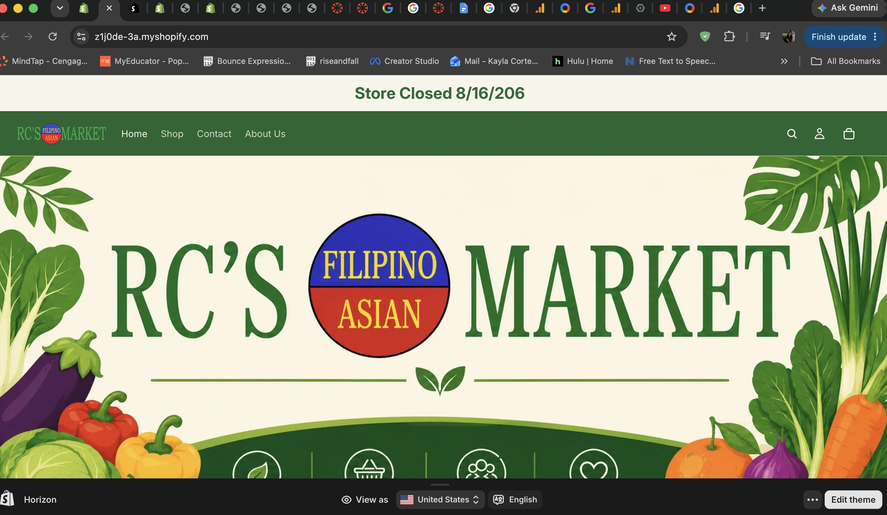
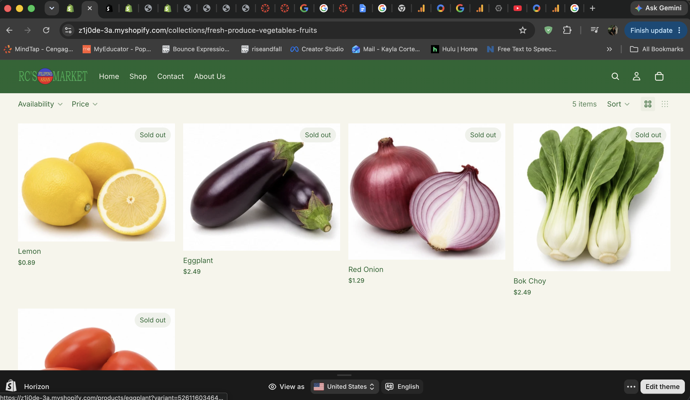
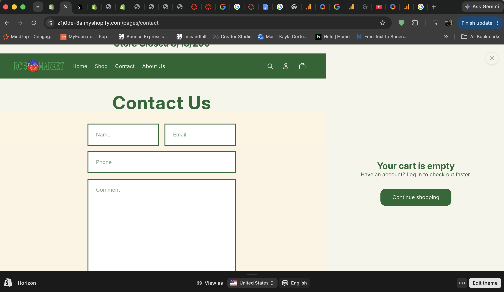
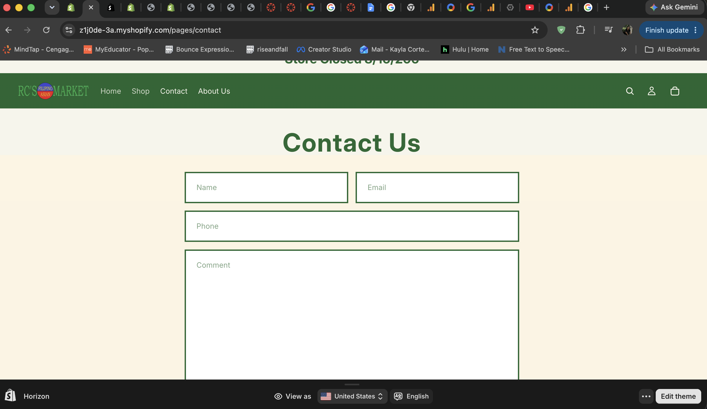
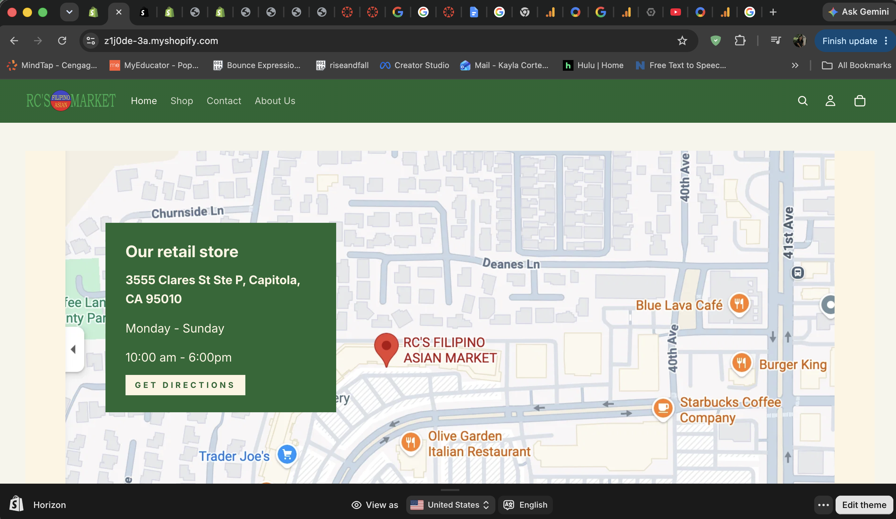
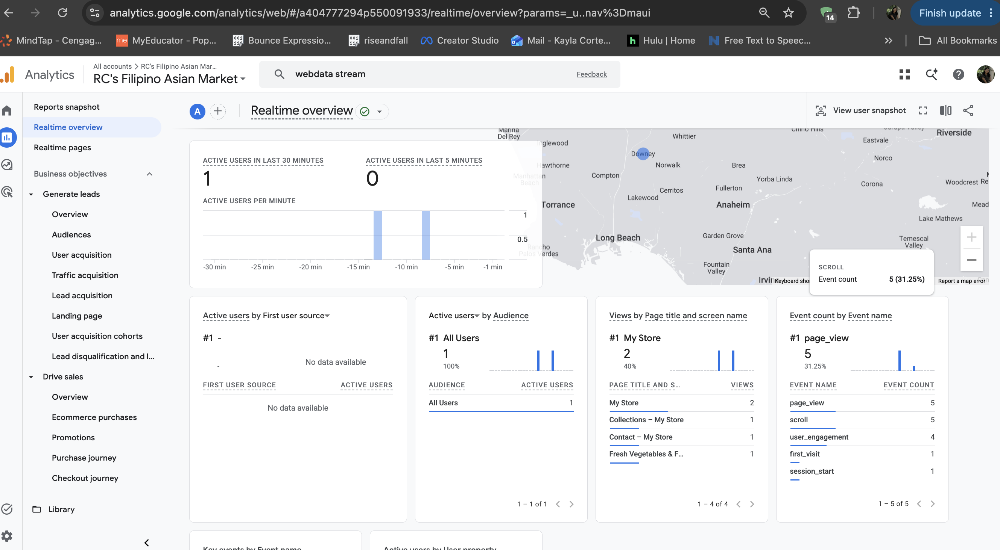

# Customer journey test
## Test the path from homepage to collection page, product page, cart, and checkout preview if available.

# Screenshots of testing process
## Include screenshots showing at least three stages of the customer journey.

# Store strengths

## Identify three strengths of your current store.

1. Color Scheme and branding is placed where needed.
2. Clear text, not too many options for easy navigation.
3. User friendly, it is not overwhelming with CTAs.

# Areas for improvement
## Identify three areas that still need improvement.

1. Size of the banner and products.
2. Text is clear but inconsistent.
3. Homepage makes it hard to see that you can scroll down.

# Analytics review
## Include a screenshot or brief discussion of available Shopify or GA4 analytics.

There is limited data to analyze at the moment, but we can see that a few sessions were able to explore beyond the home page to collections, contact, fruits, vegetables. As for the page_view one user triggered five page views and five scroll events across multiple pages. Therefore, there is exploration and exploration path needs to be improved.

# Improvement plan
## Write one paragraph explaining what you plan to improve before the final submission.

I plan to refine the banner sizing, it is not necessary to take that much space. This can impact the customer journey if we want to share featured items and they can learn our store hours and location. The navigation bar is simple, which makes it user friendly, however, the text is too small in comparison of the size of the banner and product images. It is also the same for the icons for search, profile, and cart. Along with removing the cart option as well, this is due to not taking online orders at the moment for the store. It can be added later on when staffing becomes available.

# Appendix

[Clickable Link Github]()

[Clickable Link Github Repo]()